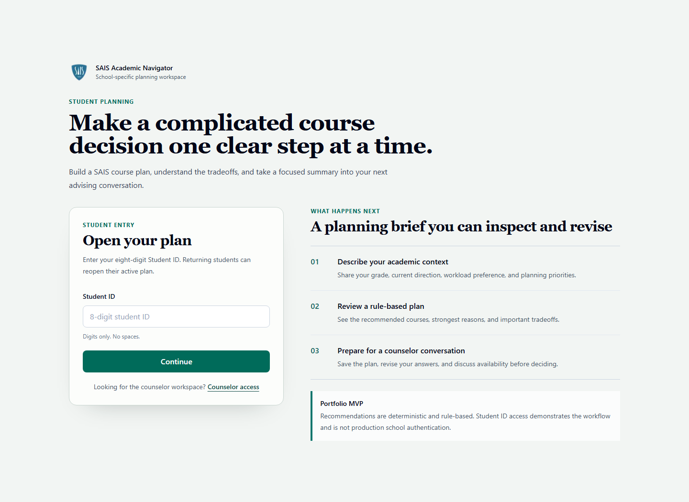
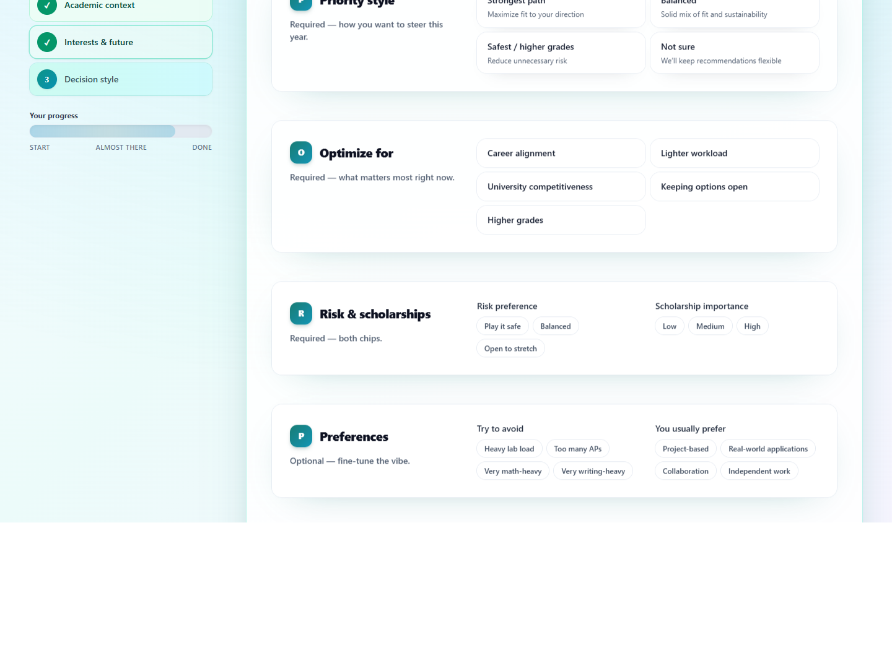
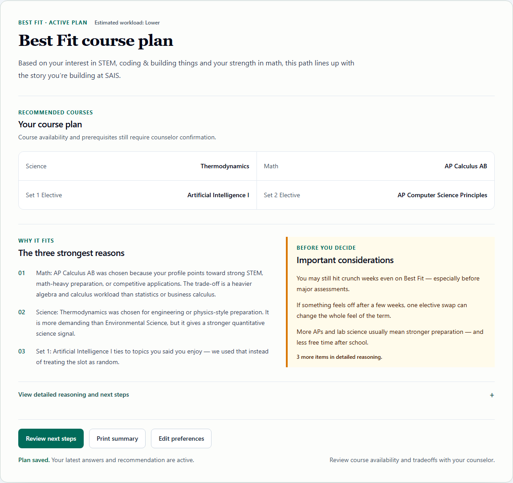
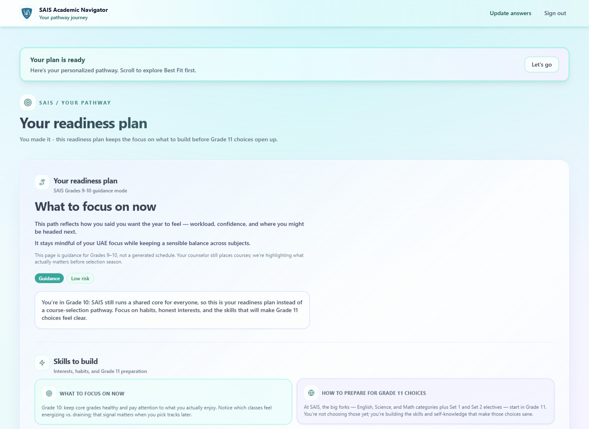
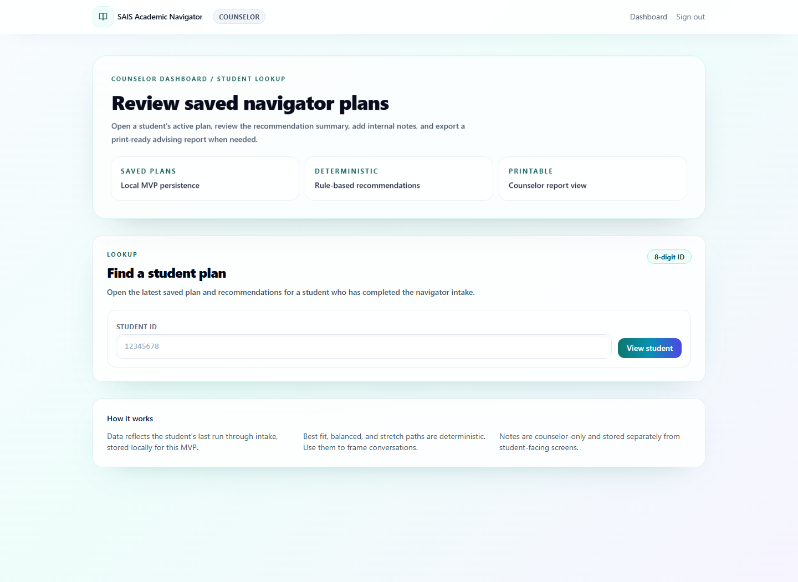
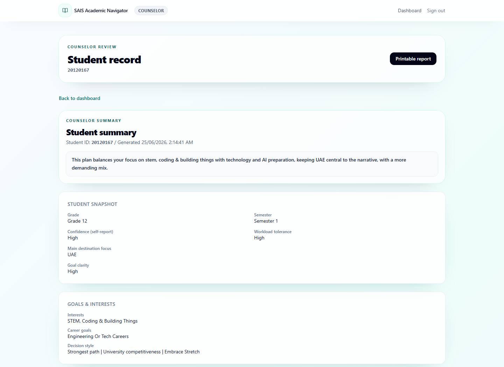
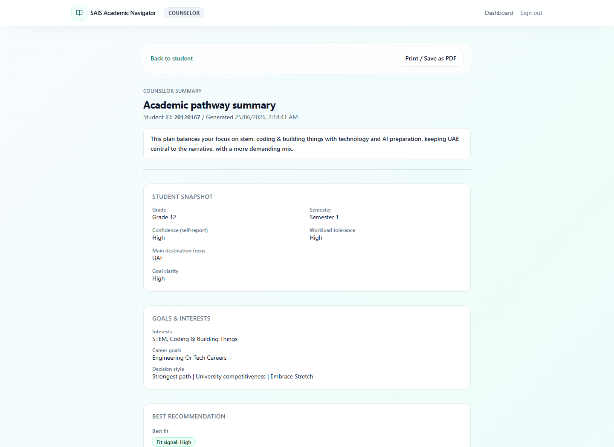

# SAIS Academic Navigator

> A deterministic, rule-based academic planning and decision-support platform for SAIS Dubai.

## Live Demo

[Open the primary Vercel deployment](https://academic-pathfinder-app.vercel.app/)

This public deployment is a portfolio/demo MVP. It is not production-approved for real student records or an official school deployment.

## Overview

SAIS Academic Navigator turns a multi-step student intake into grade-aware academic planning suggestions. Students describe their interests, strengths, workload tolerance, and future goals; the application then evaluates generated course combinations with deterministic rules and weighted match factors.

The project is designed for an estimated school audience of approximately 300 students. This is a design target, not a claim of active users, adoption, or academic validation.

## Current Product Status

- Student intake, saved-plan, recommendation dashboard, and counselor review workflows are implemented.
- Grade 9–10 students receive one readiness plan; Grade 11–12 students may receive Best Fit, Balanced, and Stretch paths.
- Counselors use a shared demo access code, look up one saved plan by student ID, add internal notes, and open a printable summary.
- Authentication and persistence are MVP-grade and intended only for portfolio demonstrations.
- Recommendations should be reviewed with a qualified school counselor.

## Key Features

- **Guided student intake:** Captures academic confidence, interests, career direction, target countries, workload tolerance, and planning priorities.
- **Rule-based pathway recommendations:** Produces repeatable results from the same inputs without machine learning, an LLM, or probabilistic prediction.
- **Grade-aware output:** Uses a readiness format for Grades 9–10 and pathway comparisons for Grades 11–12.
- **Student dashboard:** Explains selections, trade-offs, warnings, and suggested next steps.
- **Counselor lookup:** Opens the latest saved plan for a supplied eight-digit student ID; there is no full student roster.
- **Counselor notes and print view:** Supports internal notes and a printable advising summary.
- **Optional hosted persistence:** Uses Supabase when configured and a JSON/file store otherwise.
- **Responsive interface:** Supports desktop and mobile layouts.

## Recommendation Engine

The engine is deterministic and rule-based. It is not a trained AI model, chatbot, statistical predictor, or academically validated recommendation system.

Current implementation facts:

- 57-course catalog
- 1,440 or 1,728 generated candidate plans, depending on the grade/semester scenario
- Nine weighted fit factors
- Six current hard-validator functions
- Stable, characterized recommendation ordering and warning behavior

Scores are deterministic match scores used to compare candidate plans. They are not probabilities, confidence intervals, admission forecasts, or measures of academic success.

Current prerequisite and sequence enforcement is incomplete. The repository includes prototype course and policy data that requires counselor review before any controlled school pilot. The engine supports advising conversations; it does not replace school policy or qualified counseling.

## Screenshots

All repository screenshots use synthetic demo data.

### Student Login



### Guided Intake



### Grade 12 Recommendation Dashboard



### Grade 10 Readiness Mode



### Counselor Student Lookup



### Counselor Student Summary



### Printable Counselor Report



## Tech Stack

- **Framework:** Next.js 15.5.21 App Router (Maintenance LTS)
- **Language:** TypeScript
- **UI:** React 19.0, Tailwind CSS, and project CSS
- **Forms and validation:** React Hook Form and Zod
- **MVP sessions:** `jose`-signed HTTP-only cookies
- **Persistence:** Optional Supabase service-role access or a JSON/file fallback
- **Testing:** Vitest, Playwright Test, and axe-core
- **CI:** GitHub Actions

## Architecture

- `src/app/`: Pages, layouts, and Route Handlers
- `src/components/`: Student, counselor, and shared UI components
- `src/lib/domain/`: Deterministic recommendation, scoring, and validation logic
- `src/lib/auth/`: MVP student and counselor session helpers
- `src/lib/persistence/`: Supabase and JSON/file persistence adapters
- `src/data/sais/`: Prototype course, template, and rule data
- `tests/`: Synthetic fixtures and behavior-characterization tests

## Demo Access

Use only clearly synthetic eight-digit IDs.

- Example synthetic ID: `90000001`
- On a fresh deployment, a valid unused ID starts a new intake.
- If the same synthetic ID already has a saved plan in the configured store, login opens the returning-student flow.
- Counselor lookup works only after that exact synthetic ID has completed and saved an intake.
- The repository does not seed an existing plan for this ID.
- Counselor access uses the shared `COUNSELOR_ACCESS_CODE` configured by the deployment owner.

See [DEMO.md](./DEMO.md) for the complete walkthrough.

## Local Setup

### Requirements

- Node.js 20.x
- npm 10.x or later

### Installation

```bash
npm ci
```

Copy `.env.example` to `.env.local`, set the required demo secrets, and start the development server:

```bash
npm run dev
```

Open [http://localhost:3000](http://localhost:3000).

### Environment Variables

- `STUDENT_SESSION_SECRET`: Required signing secret for student demo sessions.
- `COUNSELOR_ACCESS_CODE`: Required shared demo code for counselor access.
- `COUNSELOR_SESSION_SECRET`: Optional separate counselor signing secret; falls back to `STUDENT_SESSION_SECRET`.
- `SUPABASE_URL`: Optional Supabase project URL.
- `SUPABASE_SERVICE_ROLE_KEY`: Optional server-only service role key; required with `SUPABASE_URL`.
- `DATA_DIR`: Optional JSON/file data directory when Supabase is not configured.

Never expose `SUPABASE_SERVICE_ROLE_KEY` through a `NEXT_PUBLIC_*` variable.

## Testing and Quality

Run the project with Node.js 20.x and the committed lockfile:

```bash
npm ci
npm run lint
npm run typecheck
npm run test:run
npm run build
npm run quality
npx playwright install chromium
npm run test:e2e
```

The current unit suite contains 31 automated tests:

- recommendation-engine characterization tests preserve current scoring, ordering, warnings, explanations, and output behavior;
- catalog and validator tests cover the 57-course catalog, candidate counts, nine weight factors, and six current hard-validator functions;
- every test fixture is synthetic.

The browser suite uses an isolated synthetic file store and covers protected routes, student login/intake/dashboard/returning-student flows, counselor login/lookup/notes/report flows, failure recovery, mobile layout, print media, and automated axe scans on critical pages. Browser output is written under `output/playwright/`; the normal `.data` directory is never used.

`npm run quality` remains the fast lint/typecheck/unit/build gate. Run `npm run test:e2e` separately after installing Chromium. See [docs/TESTING.md](./docs/TESTING.md) for commands and isolation details, and [docs/ACCESSIBILITY.md](./docs/ACCESSIBILITY.md) for the automated and manual accessibility scope.

Next.js 15.5 deprecates `next lint`, so `npm run lint` invokes the ESLint CLI directly while retaining the existing Core Web Vitals configuration.

GitHub Actions runs `npm ci`, lint, typecheck, Vitest, the production build, Chromium installation, and Playwright E2E in that order. Failure-only Playwright reports, screenshots, videos, and traces are retained as workflow artifacts for seven days. The project does not claim full WCAG conformance or performance benchmarks.

## Persistence and Deployment

### Primary Vercel Deployment

The current live demo is hosted at [academic-pathfinder-app.vercel.app](https://academic-pathfinder-app.vercel.app/).

Recommended Vercel settings:

1. Framework preset: Next.js
2. Install command: `npm ci`
3. Build command: `npm run build`
4. Node.js version: `20.x`
5. Required variables: `STUDENT_SESSION_SECRET`, `COUNSELOR_ACCESS_CODE`
6. Recommended durable-demo variables: `SUPABASE_URL`, `SUPABASE_SERVICE_ROLE_KEY`

Vercel function filesystems are not durable application storage. Without Supabase, the JSON fallback may use temporary storage and saved plans or notes may disappear across instances, cold starts, or deployments.

### Optional Supabase Persistence

When both Supabase variables are set, server-side persistence uses Supabase for student plans and counselor notes. Otherwise, the same application workflows use the JSON/file fallback.

The schema is in [docs/supabase-schema.sql](./docs/supabase-schema.sql). The included configuration is still MVP-grade and is not a complete production identity, authorization, auditing, retention, or privacy system.

Render was used in an earlier deployment workflow but is not the current public deployment. Historical Render-specific setup is intentionally omitted.

## What Taysir Built

Taysir created the product concept and problem definition, designed the user flows, and implemented the Next.js and TypeScript application. Verified contributions include:

- student intake and returning-student workflows;
- deterministic recommendation-engine integration;
- student dashboard and pathway explanations;
- counselor lookup, review, notes, and printable summaries;
- saved-plan persistence and optional Supabase integration;
- Vercel deployment;
- project documentation;
- automated recommendation characterization tests and GitHub Actions CI.

## Privacy and Security

- Repository fixtures and screenshots use synthetic demo data.
- Real student information must never be committed.
- The application is a portfolio/demo MVP, not production school infrastructure.
- Eight-digit ID login and a shared counselor code are demo-oriented and unsuitable for real school records.
- A production deployment would require stronger identity verification, role-based access control, audit logging, retention controls, privacy governance, incident procedures, and school approval.

## Known Limitations

- Prerequisite and sequence enforcement is incomplete.
- Course, scoring, and policy data has not been independently validated by the school.
- Match scores are heuristic and have not been academically or statistically validated.
- Authentication is demo-oriented.
- Supabase support does not by itself provide a production governance model.
- Counselor access uses lookup rather than a roster, named accounts, roles, or plan flagging.
- Five high-severity npm audit package paths remain because resolving them requires a major Next.js and matching ESLint-config migration. See [docs/dependency-audit.md](./docs/dependency-audit.md).

## Roadmap

Potential future milestones, subject to separate review:

- verify prerequisite and sequence rules with qualified counselors;
- replace prototype policy data with counselor-reviewed sources;
- implement stronger identity, access control, auditing, and retention;
- establish production database workflows;
- expand browser coverage when new student or counselor workflows are added;
- conduct manual accessibility testing with assistive technology;
- add measured performance budgets after a representative deployment baseline exists;
- conduct a controlled, school-approved pilot evaluation.

---

**Portfolio summary:** Built a full-stack academic planning MVP with Next.js 14 and TypeScript, integrating a deterministic recommendation engine, student intake, saved plans, counselor review, printable summaries, automated characterization tests, and CI. The project is presented as decision-support software with explicit prototype, privacy, and validation limits.
